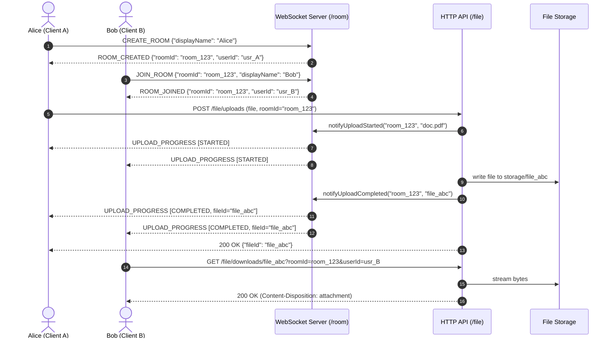

# SocketDrop 🚀

<div align="center">


**A high-performance, real-time room-first file sharing platform built with Java, Spring Boot, and WebSockets.**  
*Instant peer transfers with live progress telemetry — zero database, zero registration, zero persistence overhead.*

[Explore Features](#-key-features) • [Architecture](#-architecture) • [API Reference](#-api-reference) • [WebSocket Protocol](#-websocket-protocol) • [Quickstart](#-quickstart) • [Docker Deployment](#-docker--container-deployment)

</div>

---

## 📖 Overview

**SocketDrop** is an ultra-lightweight, ephemeral file transfer system designed for ad-hoc, peer-to-peer file distribution across local networks and the internet.

Traditional cloud transfer solutions require sign-ups, OAuth tokens, and persistent databases. SocketDrop removes all friction:
- **Instant Rooms**: Create or join isolated rooms using unique room codes or 1-click shareable URLs with QR codes.
- **Real-Time Telemetry**: File uploads immediately broadcast live progress updates (`STARTED`, `COMPLETED`, `FAILED`) to every participant connected to the room via WebSockets.
- **Zero-Footprint Lifecycle**: Rooms exist exclusively in-memory during active sessions. When participants leave, room state is atomically evicted.
- **Lightning-Fast Reactive UI**: Single-page application crafted with pure vanilla CSS and JavaScript, supporting both Dark and Light visual themes with sub-millisecond responsiveness.

---

## ✨ Key Features

- ⚡ **WebSocket-Powered Signaling**: Low-latency bi-directional control channel on `/room` with thread-safe session concurrency.
- 🛡️ **Room-Authorized Transfers**: Downloads require active room and user membership validation.
- 📦 **Streaming HTTP REST API**: Chunks and streams multipart files safely up to 50 MB without memory saturation.
- 🔒 **Security-Hardened File Engine**: Strict path traversal prevention (CWE-22 / CWE-73), unclosed file-descriptor leak guards, and RFC 5987 / 6266 filename sanitization against HTTP header injection.
- 📱 **QR Code & Shareable Links**: Instant URL prefill (`/?roomId=...`) with automated client-side QR generation for mobile transfer.
- 🌓 **ImpactLens-Grade Design**: Modern glassmorphism UI with metric counters, interactive drag-and-drop zone, file repository feed, live telemetry console, and instant theme switching.
- 🐳 **Container Native**: Production-ready multi-stage Docker build and Docker Compose orchestration.

---

## 🏛️ Architecture

SocketDrop combines **Spring WebSocket** for event signaling and **Spring Web (REST)** for high-throughput binary file streaming.

```
┌────────────────────────────────────────────────────────────────────────┐
│                   Frontend Single-Page Application                     │
│               (HTML5, Vanilla JS, Reactive CSS Design)                 │
└───────────────────┬────────────────────────────────┬───────────────────┘
                    │ WebSocket (/room)              │ HTTP REST (/file/...)
                    ▼                                ▼
       ┌───────────────────────────┐   ┌───────────────────────────┐
       │   RoomWebSocketHandler    │   │ FileUpload / Download Ctrl│
       └─────────────┬─────────────┘   └─────────────┬─────────────┘
                     │                               │
        ┌────────────┴────────────┐                  │
        ▼                         ▼                  ▼
┌──────────────┐          ┌──────────────┐   ┌──────────────┐
│ RoomRegistry │          │SessionReg.   │   │ StorageServ. │
│ (In-Memory)  │          │ (In-Memory)  │   └───────┬──────┘
└──────────────┘          └──────────────┘           │
        ▲                         ▲                  ▼
        │                         │          ┌──────────────┐
        └────────────┬────────────┘          │ Disk Storage │
                     │                       │  (/storage)  │
              ┌──────┴──────┐                └──────────────┘
              │ProgressServ.│
              └─────────────┘
```

### Room Self-Destruct

Any member can wipe a room instantly. The server deletes every file owned by that room from disk,
drops their metadata, broadcasts `ROOM_DESTROYED`, then closes every socket in the room — the
initiator included. Nothing survives.

```json
{ "type": "DESTROY_ROOM" }
```

Server reply (broadcast to all peers, then sockets close with code `4001`):

```json
{
  "type": "ROOM_DESTROYED",
  "roomId": "K7Q9XD",
  "deletedFiles": 3,
  "message": "Room destroyed — 3 file(s) permanently deleted"
}
```

---

### Event Sequence Diagram



---

## 📡 API Reference

### HTTP Endpoints

| Method | Endpoint | Description | Query / Form Parameters | Status Codes |
|---|---|---|---|---|
| `POST` | `/file/uploads` | Upload a file to an active room | `file` (Multipart), `roomId` (String, required) | `200 OK`, `400 Bad Request` |
| `GET` | `/file/downloads/{fileId}` | Download a file from a room | `roomId` (required), `userId` (required) | `200 OK`, `400 Bad Request`, `403 Forbidden`, `404 Not Found` |
| `DELETE` | `/file/downloads/{fileId}` | Delete a file from room | `roomId` (optional), `userId` (optional) | `204 No Content`, `403 Forbidden`, `404 Not Found` |

#### Upload File Example

```bash
curl -X POST http://localhost:8080/file/uploads \
  -F "file=@presentation.pdf" \
  -F "roomId=room_4d5e4064-352c-45e0-acc6-1aeb8f4f1ad9"
```

**Response (200 OK):**
```json
{
  "fileId": "file_8b7c93e1-2f34-4b5c-890a-112233445566",
  "fileName": "presentation.pdf",
  "fileSize": 1048576
}
```

#### Download File Example

```bash
curl -O -J "http://localhost:8080/file/downloads/file_8b7c93e1-2f34-4b5c-890a-112233445566?roomId=room_4d5e4064-352c-45e0-acc6-1aeb8f4f1ad9&userId=username_9f1b2c3d"
```

---

## 🔌 WebSocket Protocol

Connect to `ws://localhost:8080/room` (or `wss://...` in production).

### Client-to-Server Messages

#### 1. Create Room
```json
{
  "type": "CREATE_ROOM",
  "displayName": "Alice"
}
```

#### 2. Join Room
```json
{
  "type": "JOIN_ROOM",
  "roomId": "room_4d5e4064-352c-45e0-acc6-1aeb8f4f1ad9",
  "displayName": "Bob"
}
```

#### 3. Leave Room
```json
{
  "type": "LEAVE_ROOM"
}
```

#### 4. Destroy Room (Self-Destruct)
Deletes all room files from the server and kicks everyone out.
```json
{
  "type": "DESTROY_ROOM"
}
```

### Server-to-Client Messages

#### 1. Room Created
```json
{
  "type": "ROOM_CREATED",
  "roomId": "room_4d5e4064-352c-45e0-acc6-1aeb8f4f1ad9",
  "userId": "username_1a2b3c4d-5e6f-7a8b",
  "displayName": "Alice"
}
```

#### 2. Room Joined
```json
{
  "type": "ROOM_JOINED",
  "roomId": "room_4d5e4064-352c-45e0-acc6-1aeb8f4f1ad9",
  "userId": "username_9a8b7c6d-5e4f-3a2b",
  "displayName": "Bob"
}
```

#### 3. Upload Progress Broadcast
```json
{
  "type": "UPLOAD_PROGRESS",
  "roomId": "room_4d5e4064-352c-45e0-acc6-1aeb8f4f1ad9",
  "status": "COMPLETED",
  "fileId": "file_8b7c93e1-2f34-4b5c-890a-112233445566",
  "fileName": "presentation.pdf",
  "fileSize": 1048576,
  "message": "Upload completed"
}
```

#### 4. Room Destroyed Broadcast
```json
{
  "type": "ROOM_DESTROYED",
  "roomId": "K7Q9XD",
  "deletedFiles": 3,
  "message": "Room destroyed — 3 file(s) permanently deleted"
}
```

#### 5. Error Message
```json
{
  "type": "ERROR",
  "message": "Room does not exist"
}
```

---

## 🔒 Security Hardening

SocketDrop implements defensive engineering practices:

- **Path Traversal Protection (CWE-22 / CWE-73)**: All file resolution is validated using `FileUtils.generatePath()`, verifying that paths normalize strictly within the configured root directory without escaping.
- **Descriptor Leak Prevention**: Authorization and metadata verification execute before opening underlying file input streams, preventing OS file descriptor leaks on permission errors.
- **Thread-Safe WebSocket Delivery**: Sessions are wrapped with `ConcurrentWebSocketSessionDecorator` and synchronized message dispatching to eliminate Tomcat `TEXT_PARTIAL_WRITING` concurrency race conditions.
- **HTTP Header Sanitization**: Content-Disposition headers are formatted according to RFC 5987 / 6266 with UTF-8 encoding, preventing carriage return injection and header splitting.
- **Harmonized Size Limits**: Uniform 50MB file size ceiling configured consistently across multipart, application service, and HTTP download boundaries.
- **Atomic Room Codes**: Room codes are claimed via an atomic `reserveRoom` operation, so two concurrent creators can never be handed the same code. A reserved-but-unjoined code stays invisible to joiners.
- **Guaranteed Room Cleanup**: Self-destruct removes every file blob and its metadata for a room; a single undeletable entry cannot abort teardown.

---

## 🚀 Quickstart

### Prerequisites
- **JDK 17** or higher
- **Maven 3.8+** (or use bundled `./mvnw`)

### 1. Clone & Build
```bash
git clone https://github.com/princeworks/socket-drop.git
cd socket-drop
./mvnw clean package
```

### 2. Run the Application
```bash
./mvnw spring-boot:run
```

Open your browser at `http://localhost:8080`.

---

## 🐳 Docker & Container Deployment

### Running with Docker

```bash
# Build the image
docker build -t socket-drop:latest .

# Run the container with isolated volume
docker run --rm -p 8080:8080 \
  -v socket_drop_storage:/app/storage \
  socket-drop:latest
```

### Running with Docker Compose

```bash
docker compose up --build -d
```

### Environment Configuration

| Variable | Default Value | Description |
|---|---|---|
| `SPRING_FILE_BASE_PATH` | `/app/storage` | Directory path where uploaded files are written |
| `SPRING_FILE_MAX_SIZE` | `52428800` (50 MB) | Max file size allowed for storage service |
| `SPRING_FILE_MAX_DOWNLOAD_SIZE` | `52428800` (50 MB) | Max file size permitted for download |
| `SPRING_SERVLET_MULTIPART_MAX_FILE_SIZE` | `50MB` | Servlet multipart individual file upload ceiling |
| `SPRING_SERVLET_MULTIPART_MAX_REQUEST_SIZE` | `50MB` | Servlet multipart total request payload ceiling |

---

## 🧪 Testing

SocketDrop includes a test suite covering controller layers, security policies, WebSocket messaging, and concurrency invariants:

```bash
./mvnw test
```

### Test Coverage Highlights:
- **`FileUtilsTest`**: Path traversal exploits, null paths, and boundary conditions.
- **`RoomWebSocketHandlerTest`**: Room lifecycle, malformed payloads, dead socket recovery, and null safety.
- **`FileUploadControllerTest`**: Upload workflows, room existence validation, and size checks.
- **`FileDownloadControllerTest`**: Room authorization, user matching, and size limits.
- **`GlobalExceptionHandlerTest`**: Multipart exception handling and internal path masking.
- **`RoomRegistryTest` & `SessionRegistryTest`**: Atomic room eviction, thread safety, and session preservation.

---

## 📄 License

This project is licensed under the **MIT License**.

---

<div align="center">

Crafted with ❤️ by **[Prince Pal](https://www.linkedin.com/in/princepal-dev/)**

</div>
